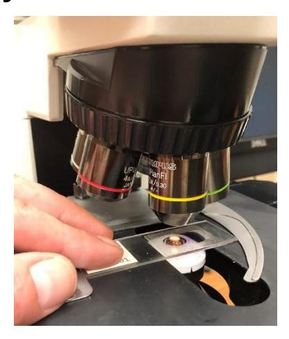
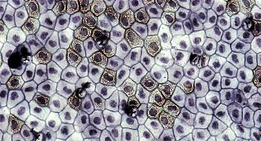
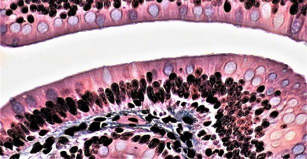
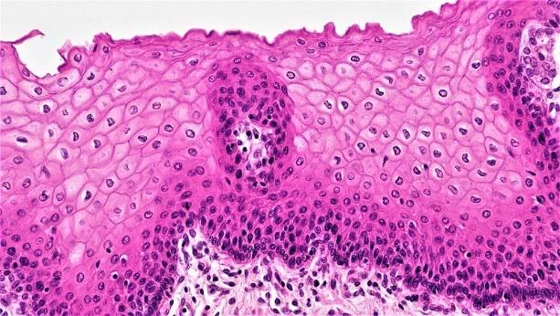
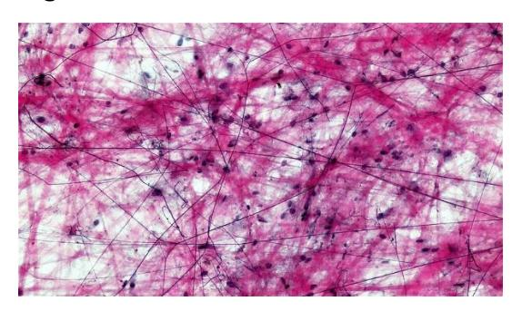
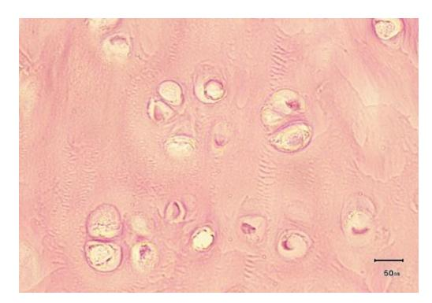
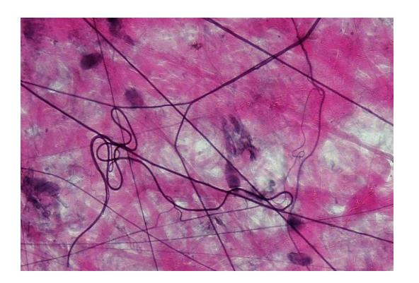

# **Histology/Tissues**

**Figure 4.1 Slide Underneath a Microscope.**

## **Objectives**

During this lab you will use the microscope and diagrams to review the four tissue types as well as familiarize yourself with their location and function in the body.

Upon completion of this lab session, you should be able to:

-   Name a tissue as belonging to one of these four categories: epithelial tissue, connective tissue, muscle tissue, nervous tissue.
-   Explain how the anatomical structure of a tissue supports its functions.
-   Describe the structure, function, and location of the four basic tissues of the body.
-   In histology slides, you should be able to identify each tissue, list functions for each, and list locations of each tissue, identify and list functions for the associated structures:
    -   Epithelial tissue
        -   Identify the different epithelial tissue types and their structures.
        -   Classify an epithelial tissue by its shape and layer number.
    -   Epithelial tissue features:
        -   Identify the apical and basal surfaces.
        -   Free space
        -   Basement membrane
        -   Presence of microvilli, cilia, or goblet (mucous) cells
    -   Connective tissue (c.t.)
        -   Identify and describe the connective tissues.
        -   Identify the locations of each cartilage type.
        -   Identify, compare, and contrast the three types of cartilage.
            -   Connective tissue proper
-   Loose connective tissue
    -   Areolar connective tissue
    -   Adipose tissue
-   Dense (fibrous) connective tissue
    -   Regular dense c.t.
    -   Irregular dense c.t.
-   Supportive connective tissue
    -   Cartilage
        -   Hyaline cartilage
        -   Fibrocartilage
        -   Elastic cartilage
    -   Bone detail in skeletal system
        -   Identify the following structures:
            -   osteons,
            -   osteocytes
            -   osteoblasts
            -   lacuna
-   Fluid connective tissue
    -   Blood detail in cardiovascular system
    -   Lymph -- detail in lymphatic system
-   Muscle tissue: May be required in a later chapter.
    -   Identify where you can find each muscle tissue in the body.
    -   Compare and contrast the three muscle tissue types.
        -   Skeletal muscle
            -   Structures of the skeletal cells:
                -   Striations
                -   Nucleus
        -   Smooth muscle
        -   Cardiac muscle
            -   Structures of the Cardiac cells:
                -   Striations
                -   Intercalated discs
                -   Nucleus
-   Nervous tissue: May be required in a later chapter.
    -   Identify the difference between a glial and nervous cell.
    -   Describe the functions of
        -   The neuron
        -   Each glial cell type.
    -   Identify the structures within a nervous cell:
        -   neurons,
        -   axons
        -   dendrites
        -   cell bodies
        -   nucleus

## **Prelab Activities**

## **Prelab Activity 4.1**

Define the following terms using your textbook or other reliable academic sources.

**Types of tissues:**

-   Epithelial ***tissue that covers body surfaces, lines cavities, and forms glands; it protects, absorbs, secretes, and filters***
-   Connective ***tissue that supports, binds, protects, stores energy, and transports materials through the body***
-   Muscular ***tissue made of cells that contract to produce movement, posture, heat, or organ movement***
-   Nervous ***tissue that detects stimuli and sends electrical signals to coordinate body responses***

**Epithelial Tissues:**

-   Simple squamous ***one thin layer of flat cells; allows rapid diffusion and filtration***
-   Stratified squamous (keratinized/nonkeratinized) ***many layers with flat apical cells; protects against abrasion. Keratinized forms skin; nonkeratinized lines moist surfaces***
-   Simple cuboidal ***one layer of cube-shaped cells; mainly functions in secretion and absorption***
-   Stratified cuboidal/columnar – rare ***two or more layers of cuboidal or columnar cells; protects and reinforces larger ducts***
-   Simple columnar ***one layer of tall cells; absorbs and secretes, often with goblet cells or microvilli***
-   Pseudostratified columnar epithelium ***appears layered but all cells touch the basement membrane; often ciliated and secretes/moves mucus***
-   Transitional epithelium ***stratified tissue that stretches; lines urinary organs such as the bladder***

**Define the following epithelial features:**

-   Epithelial layers:
    -   Simple ***one layer of cells***
    -   Stratified ***two or more layers of cells***
-   Surfaces:
    -   Apical ***the free surface facing a body cavity, lumen, or outside space***
    -   Basal ***the bottom surface attached to the basement membrane***
    -   Basement membrane ***thin extracellular layer that anchors epithelium to underlying connective tissue***

**Connective Tissue:**

-   Cartilage ***firm, flexible connective tissue with chondrocytes in lacunae and a rubbery matrix.***\_
-   Areolar connective tissue ***loose connective tissue that wraps and cushions organs and holds tissue fluid.***
-   Hyaline cartilage ***smooth, glassy cartilage that supports and reduces friction at joints.***
-   Adipose tissue ***fat-storing connective tissue that cushions, insulates, and stores energy.***
-   Fibrocartilage ***tough cartilage with thick collagen fibers; resists compression and tension.***
-   Elastic cartilage ***cartilage with elastic fibers that provides flexible support.***
-   Regular dense connective tissue ***parallel collagen fibers that resist pulling in one direction; found in tendons and ligaments.***
-   Irregular dense connective tissue ***collagen fibers arranged in many directions; resists stress from multiple directions.***
-   Bone ***hard connective tissue that supports the body, protects organs, stores minerals, and produces blood cells.***
-   Blood – detail in cardiovascular system ***fluid connective tissue that transports gases, nutrients, wastes, hormones, and immune cells.***

**Connective Tissue Features:**

-   Collagen fibers ***strong protein fibers that provide tensile strength and resist stretching.***
-   Elastin fibers ***stretchy protein fibers that allow tissue to recoil after stretching.***
-   Extracellular matrix ***nonliving material outside cells made of ground substance and fibers.***
-   Cells ***living components of connective tissue that make, maintain, or store matrix materials.***
    -   Fibroblasts ***cells that produce collagen, elastic fibers, and ground substance.***
    -   Adipocytes ***fat cells that store lipids.***
    -   Chondrocytes ***cartilage cells located in lacunae.***
-   Lacuna ***small space in bone or cartilage that contains a cell.***

## **Lab Activities**

### **Lab Activity 4.1**

## **Epithelial Tissues: Classification of the Epithelial Tissues**

Epithelial tissues are classified by a) the number of layers of cells in the tissue and b) the shape of the cells within the tissue. A single layer of cells is defined as a simple layer whereas a tissue of multiple layers is called stratified. The name of the stratified tissue is based on the type of cells that are found in the apical surface. A pseudostratified tissue consists of a single layer of irregularly shaped cells. This construction led to the appearance that the tissue consisted of more than one layer.

The shape of the cells in a single layer is indicative of the function of the cells. Cells that have a flattened shape are squamous type cells. Simple squamous tissue if located in those organs whose function is to allow easy passage of molecules or compounds through the cell (e. g., alveolar tissue in the lung, and the lining of kidney tubules). Simple cuboidal cells look box-like and are associated with those tissues that are active in absorption and secretion. Finally, columnar cells are taller than they are wide.; their nucleus is usually located next to the basilar surface of the cell. These cells are also active in secretion and absorption of molecules.

### **Lab Activities**

**Figure 4.2** Identification of Epithelial Tissues.

## **Procedure for Activity 4.1**

Use the pictures in the table below to review several tissue types, locate the epithelial features, and determine how the anatomy of the tissue enables its functions.

1.  Using your textbook identify the tissues in the pictures in the table below.
2.  Examine the provided histology slides.
3.  In the picture of pseudostratified ciliated columnar epithelium, locate cilia and a goblet cell, then label them. Refer to the information and figures above or reliable internet sources for assistance. Check with your instructor to verify your accuracy.
4.  In the picture of simple columnar epithelium, locate nuclei, then label one. Check with your instructor to verify your accuracy.
5.  In the picture of simple columnar epithelium, locate the apical edge and the basal edge, then label them. Check with your instructor to verify your accuracy.
6.  For each tissue, describe how the anatomy of the tissue enables its functions.

| Image | Name | Location | Function |
|----------------------------------|---------------|------------|------------|
| **Figure 4.3** | ***Simple squamous epithelium*** | ***Alveoli of lungs; kidney glomeruli; capillary walls*** | ***Thin flat cells allow rapid diffusion and filtration.*** |
| **Figure 4.4** | ***Simple cuboidal epithelium*** | ***Kidney tubules; small gland ducts; ovary surface*** | ***Cube-shaped cells allow secretion and absorption.*** |
| **Figure 4.5** | ***Simple columnar epithelium*** | ***Digestive tract lining, especially stomach and intestines*** | ***Tall cells absorb and secrete; goblet cells produce mucus.*** |
| **Figure 4.6** | ***Stratified squamous epithelium*** | ***Lining of mouth, esophagus, vagina; epidermis if keratinized*** | ***Protects underlying tissues from abrasion*** |
| **Figure 4.7** | ***Pseudostratified ciliated columnar epithelium*** | ***Trachea and upper respiratory tract*** | ***Cilia move mucus; goblet cells secrete mucus to trap particles*** |
| **Figure 4.8** | ***Transitional epithelium*** | ***Urinary bladder, ureters, and part of urethra*** | ***Streches to allow urinary organs to expan*** |

### **Terms:**

## **Epithelial Tissues:**

-   Simple squamous

-   Simple cuboidal

-   Simple columnar

-   Transitional

-   Stratified squamous

## **Lab Activity 4.2: Microscope work:**

-   For each designated tissue slide, zoom in and identify a representative section showing the provided epithelial tissue sub-type. Find a section where you can clearly identify the number of cell layers, cell shape, and apical vs. basal surfaces.
-   Take a picture of that view with your cellphone.
-   Upload the picture into a PowerPoint or Microsoft Word document.
-   Annotate the image to clearly identify:
    -   Simple vs. stratified tissue
    -   Shape of the cells in the epithelial layer
    -   Apical surface
    -   Basal surface

## **Procedure for Activity 4.2: Microscope work:**

Using a light microscope review the tissues assigned by your Lab Instructor at a magnification of 400x. Draw and label each tissue type in the spaces provided. Your information should provide where it would be found in the body along with the magnification of the tissue.

| Tissue              | Magnification | Location |
|---------------------|---------------|----------|
| Simple squamous     |               |          |
| Simple cuboidal     |               |          |
| Simple columnar     |               |          |
| Transitional        |               |          |
| Stratified Squamous |               |          |

## **Connective Tissue**

**Figure 4.9** Connective Tissues Illustration: Connective Tissue Types.

## **Lab Activity 4.3: Microscope Work:**

-   For each designated tissue slide, zoom in and identify a representative section showing the provided connective tissue sub-type. Find a section where you can clearly identify the number of cell layers, cell shape, and apical vs. basal surfaces.
-   In the boxes provided below draw and label the following connective tissues in your microscope
-   Next, take a picture of that view with your cellphone.
-   Upload the picture into a PowerPoint or Microsoft Word document.
-   Annotate the image to clearly identify the following features when present:
    -   collagen
    -   elastic
    -   extracellular matrix
    -   lacuna
    -   adipocytes
    -   fibroblasts
    -   chondrocytes

## **Connective Tissue Types**

a)  Structural Connective Tissue

-   Loose Connective Tissue (Areolar connective tissue)
    -   Areolar
    -   Adipose Tissue
-   Dense (fibrous) connective tissue
    -   Regular
    -   irregular
-   Fluid Connective Tissues
    -   Blood
-   Supportive connective tissue
    -   Cartilage
        -   Hyaline
        -   Fibrocartilage
        -   Elastic
    -   Bone

## **Features Bone:** Dense Connective Tissues

-   Osteoprogenitor cells
-   Osteocytes
-   osteoclasts
-   Osteon
-   Lacuna
-   Canaliculi
-   osteon canal
-   matrix

### **Lab Activity 4.4: Microscope Work:**

-   Using a light microscope review the tissues assigned by your Lab Instructor at a magnification of 400x.
-   Draw and label each tissue type in the spaces provided. Your information should provide where it would be found in the body along with the magnification of the tissue.
-   Take a picture of each tissue type for your use later when preparing for a lab practical.

| Tissue                          | Magnification | Location |
|---------------------------------|---------------|----------|
| Areolar                         |               |          |
| Adipose                         |               |          |
| Dense regular connective tissue |               |          |
| Blood                           |               |          |
| Hyaline cartilage               |               |          |
| Fibrocartilage                  |               |          |
| Elastic cartilage               |               |          |
| Bone                            |               |          |

## **Post Lab Activities**

## **Post Lab Activity 4.1**

## **Test your understanding.**

-   Discuss the two ways how epithelium can be classified.
    -   ***Epithelium is classified by number of layers and cell shape. Simple epithelium has one layer, while stratified epithelium has multiple layers. Cell shapes include squamous, cuboidal, and columnar.***
    -   ***Structure supports function: simple squamous cells are thin for diffusion in alveoli and capillaries; simple cuboidal cells absorb and secrete in kidney tubules; stratified squamous cells protect areas such as skin and the esophagus from abrasion.***
-   With Respect to the tissues
    -   ***The four major tissue types are epithelial, connective, muscle, and nervous tissue.***
    -   ***Epithelial tissue covers and lines surfaces, such as skin and digestive tract lining. Connective tissue supports and binds, such as bone, blood, and adipose. Muscle tissue contracts for movement, such as skeletal or cardiac muscle. Nervous tissue sends electrical signals and is found in the brain, spinal cord, and nerves.***
-   The ***epithelial*** tissue contains an apical surface.

## **Post Lab Activity 4.2**

## **Identify for each figure below:**

-   the tissue types and
-   the locations for each tissue below

1.  **Fig. 4.10** ***Simple squamous epithelium; found in alveoli, capillaries, and kidney glomeruli.***

2.  **Fig. 4.11** ***Simple cuboidal epithelium; found in kidney tubules and gland ducts.***

3.  **Fig. 4.12** ***Simple columnar epithelium; found lining the digestive tract.***

4.  **Fig. 4.13** ***Pseudostratified ciliated columnar epithelium; found in the trachea and upper respiratory tract.***

5.  **Fig. 4.14** ***Transitional epithelium; found in the urinary bladder and ureters.***

6.  **Fig. 4.15** ***Stratified squamous epithelium; found in the skin, mouth, esophagus, and vagina.***

## **Post Lab Activity 4.3**

## **Crosswords:**

Match the following tissue with its function or location.

### **Across**

-   4 kidney glomeruli and alveoli of lungs (6,8,10)
-   5 Carry action potentials throughout the body (6)
-   7 Cells that nourish and support (5,4)
-   9 Protects underlying tissues from abrasion (10,8,10)
-   11 Function: secretion and absorption (6,8,10)
-   12 Attached to the bones, occasionally to the skin (8,6)

### **Down**

-   1 Tendons and ligaments (5,7,10,6)
-   2 Functions as a binding tissue (5,10,6)
-   3 Mineral storage (4)
-   6 Covers the ends of long bones in joint cavities (7,9)
-   8 Contracts, propels blood in the circulation (7,6)
-   10 Mostly in the walls of hollow organs. (6,6)

## **Additional tissue review materials**

## **Areolar**

**Figure 4.16**

**Figure 4.17** Areolar Tissue (Tissue spread).

### **Regular dense connective tissue**

**Figure 4.18** Dense Regular Connective Tissue.

## **Irregular Dense Connective Tissue**

**Figure 4.19** Cross Section: Hyaline Cartilage**.**

### **Elastic Cartilage**

**Figure 4.20** Elastic Cartilage**.**

## **Fibrous Cartilage**

**Figure 4.21** Fibrous Cartilage.

### **Bone**

**Figure 4.22** 100X

## **Review Keys**

### **Tissues**

**Figure 4.23** Bone

**Figure 4.24** Fibrous Cartilage.

**Figure 4.25** Elastic Cartilage

**Figure 4.26** Loose Areolar Tissue**.**

**Figure 4.27** White Fibrous Connective Tissue, Longitudinal Section (Tendon).

**Figure 4.28** Adipose Tissue (Cross Section).

## **Crossword Puzzle Answer**

**Across: 4** Simple squamous epithelium, **5** Neuron, **7** Glial cell, **9** Stratified squamous epithelium, **11** Simple cuboidal epithelium, **12** Skeletal muscle.

**Down: 1** Dense regular connective tissue, **2** Loose connective tissue, **3** Bone, **6** Hyaline cartilage, **8** Cardiac muscle, **10** Smooth muscle.

**Chapter 4: Histology/Tissues Glossary**

| Terms | Definitions |
|------------------------------------|------------------------------------|
| adipocytes | lipid storage cells |
| adipose tissue | specialized areolar tissue rich in stored fat |
| anchoring junction | mechanically attaches adjacent cells to each other or to the basement membrane |
| apical | part of a cell or tissue which, in general, faces an open space |
| apocrine | secretion release of a substance along with the apical portion of the cell |
| apoptosis | programmed cell death |
| areolar tissue (also, loose connective tissue) | a type of connective tissue proper that shows little specialization with cells dispersed in the matrix |
| astrocyte | star-shaped cell in the central nervous system that regulates ions and uptake and/or breakdown of some neurotransmitters and contributes to the formation of the blood-brain barrier |
| atrophy | loss of mass and function |
| basal lamina | thin extracellular layer that lies underneath epithelial cells and separates them from other tissues |
| basement | a thin layer of fibrous material that anchors the epithelial tissue to the |
| membrane in | underlying connective tissue; made up of the basal lamina and reticular |
| epithelial tissue | lamina |
| blood | the fluid that circulates in the cardiovascular system |
| bone | one of the hard parts of the skeleton of a vertebrate |
| cartilage | a part or structure composed of cartilage |
| cardiac muscle | heart muscle, under involuntary control, composed of striated cells that attach to form fibers, each cell contains a single nucleus, contracts autonomously |
| cell junction | point of cell-to-cell contact that connects one cell to another in a tissue |
| chondrocytes | cells of the cartilage |
| cilia | a minute short hairlike process often forming part of a fringe |
| clotting also called | complex process by which blood components form a plug to stop bleeding |
| coagulation |  |
| collagen fiber | flexible fibrous proteins that give connective tissue tensile strength |
| connective tissue | type of tissue that serves to hold in place, connect, and integrate the body's organs and systems |
| connective tissue | membrane connective tissue that encapsulates organs and lines movable joints |
| connective tissue proper | connective tissue containing a viscous matrix, fibers, and cells. |
| cutaneous membrane skin | epithelial tissue made up of a stratified squamous epithelial cells that cover the outside of the body |
| dense connective tissue | connective tissue proper that contains many fibers that provide both elasticity and protection |
| ectoderm | outermost embryonic germ layer from which the epidermis and the nervous tissue derive |
| elastic cartilage | type of cartilage, with elastin as the major protein, characterized by rigid support as well as elasticity |
| elastic fiber | fibrous protein within connective tissue that contains a high percentage of the protein elastin that allows the fibers to stretch and return to original size |
| endocrine gland | groups of cells that release chemical signals into the intercellular fluid to be picked up and transported to their target organs by blood |
| endoderm | innermost embryonic germ layer from which most of the digestive system and lower respiratory system derive |
| endothelium | tissue that lines vessels of the lymphatic and cardiovascular system, made up of a simple squamous epithelium |
| epithelial membrane | epithelium attached to a layer of connective tissue |
| epithelial tissue | type of tissue that serves primarily as a covering or lining of body parts, protecting the body; it also functions in absorption, transport, and secretion |
| extracellular matrix | a suspension of macromolecules that supports everything from local tissue growth to the maintenance of an entire organ. |
| exocrine gland | group of epithelial cells that secrete substances through ducts that open to the skin or to internal body surfaces that lead to the exterior of the body |
| fibroblast | most abundant cell type in connective tissue, secretes protein fibers and matrix into the extracellular space |
| fibrocartilage | tough form of cartilage, made of thick bundles of collagen fibers embedded in chondroitin sulfate ground substance |
| fibrocyte | less active form of fibroblast |
| fluid connective tissue | specialized cells that circulate in a watery fluid containing salts, nutrients, and dissolved proteins |
| gap junction | allows cytoplasmic communications to occur between cells |
| goblet cell (mucous cell) | unicellular gland found in columnar epithelium that secretes mucous |
| ground substance | fluid or semi-fluid portion of the matrix |
| histamine | chemical compound released by mast cells in response to injury that causes vasodilation and endothelium permeability |
| histology | microscopic study of tissue architecture, organization, and function |
| holocrine | secretion release of a substance caused by the rupture of a gland cell, which becomes part of the secretion |
| hyaline cartilage | most common type of cartilage, smooth and made of short collagen fibers embedded in a chondroitin sulfate ground substance |
| inflammation | response of tissue to injury |
| Irregular dense connective tissue | a connective tissue characterized by collagen fibers that are arranged in a random, interwoven pattern, providing strength and resistance to stretching in multiple directions. |
| lacunae (singular = lacuna) | small spaces in bone or cartilage tissue that cells occupy |
| lamina propria | areolar connective tissue underlying a mucous membrane |
| loose connective tissue (also, areolar tissue) | type of connective tissue proper that shows little specialization with cells dispersed in the matrix |
| matrix | extracellular material which is produced by the cells embedded in it, containing ground substance and fibers |
| merocrine | secretion release of a substance from a gland via exocytosis |
| mesenchymal cell | adult stem cell from which most connective tissue cells are derived |
| mesenchyme | embryonic tissue from which connective tissue cells derive |
| mesoderm | middle embryonic germ layer from which connective tissue, muscle tissue, and some epithelial tissue derive |
| mesothelium | simple squamous epithelial tissue which covers the major body cavities and is the epithelial portion of serous membranes |
| microvilli | tiny, finger-like projections on the surface of certain cells, primarily found in the small intestine, which increase the cell's surface area to enhance absorption and secretion of substances. |
| mucous connective tissue | specialized loose connective tissue present in the umbilical cord |
| mucous gland | group of cells that secrete mucous, a thick, slippery substance that keeps tissues moist and acts as a lubricant |
| mucous membrane tissue | membrane that is covered by protective mucous and lines tissue exposed to the outside environment |
| muscle tissue | type of tissue that is capable of contracting and generating tension in response to stimulation; produces movement. |
| myelin | layer of lipid inside some neuroglial cells that wraps around the axons of some neurons |
| myocyte | muscle cells |
| necrosis | accidental death of cells and tissues |
| nervous tissue | tissue that is capable of sending and receiving impulses through electrochemical signals. |
| neuroglia | supportive neural cells |
| neuron | excitable neural cell that transfer nerve impulses |
| oligodendrocyte | neuroglial cell that produces myelin in the brain |
| primary union | condition of a wound where the wound edges are close enough to be brought together and fastened if necessary, allowing quicker and more thorough healing |
| pseudostratified | epithelium tissue that consists of a single layer of irregularly shaped and |
| columnar | sized cells that give the appearance of multiple layers; found in ducts of certain glands and the upper respiratory tract |
| Regular dense connective tissue | a connective tissue characterized by tightly packed collagen fibers arranged in parallel, providing strength and resistance to pulling forces in one direction. |
| reticular fiber | fine fibrous protein, made of collagen subunits, which cross-link to form supporting "nets" within connective tissue |
| reticular lamina | matrix containing collagen and elastin secreted by connective tissue; a component of the basement membrane |
| reticular tissue | loose connective tissue that provides a supportive framework to soft organs, such as lymphatic tissue, spleen, and the liver |
| Schwann cell | neuroglial cell that produces myelin in the peripheral nervous system |
| secondary union | wound healing facilitated by wound contraction |
| serous gland | group of cells within the serous membrane that secrete a lubricating substance onto the surface |
| serous membrane | tissue membrane that lines body cavities and lubricates them with serous fluid |
| simple columnar epithelium | tissue that consists of a single layer of column-like cells; promotes secretion and absorption in tissues and organs |
| simple cuboidal epithelium | tissue that consists of a single layer of cube-shaped cells; promotes secretion and absorption in ducts and tubules |
| simple squamous epithelium | tissue that consists of a single layer of flat scale-like cells; promotes diffusion and filtration across surface |
| skeletal muscle | muscle usually attached to bone, under voluntary control, each cell is a fiber that is multinucleated and striated |
| smooth muscle | muscle under involuntary control, moves internal organs, cells contain a single nucleus, are spindle-shaped, and do not appear striated; each cell is a fiber |
| stratified columnar epithelium | stratified columnar epithelium tissue that consists of two or more layers of column-like cells, contains glands, and is found in some ducts |
| stratified cuboidal epithelium | epithelium tissue that consists of two or more layers of cube-shaped cells, found in some ducts |
| stratified squamous epithelium tissue | epithelium tissue that consists of multiple layers of cells with the most apical being flat scale-like cells; protects surfaces from abrasion |
| striation | alignment of parallel actin and myosin filaments which form a banded pattern |
| supportive connective tissue | type of connective tissue that provides strength to the body and protects soft tissue |
| synovial membrane | connective tissue membrane that lines the cavities of freely movable joints, producing synovial fluid for lubrication |
| tight junction | forms an impermeable barrier between cells |
| tissue | group of cells that are similar in form and perform related functions |
| tissue membrane | thin layer or sheet of cells that covers the outside of the body, organs, and internal cavities |
| transitional epithelium | stratified epithelium found in the urinary tract, characterized by an apical layer of cells that change shape in response to the presence of urine |
| vasodilation | widening of blood vessels |
| wound contraction | process whereby the borders of a wound are physically drawn together |
